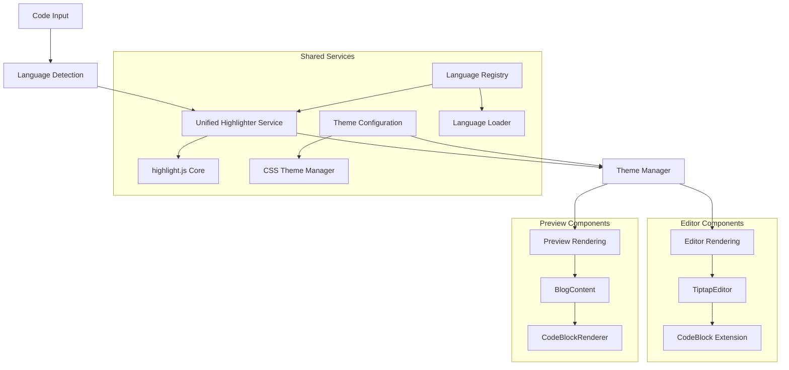
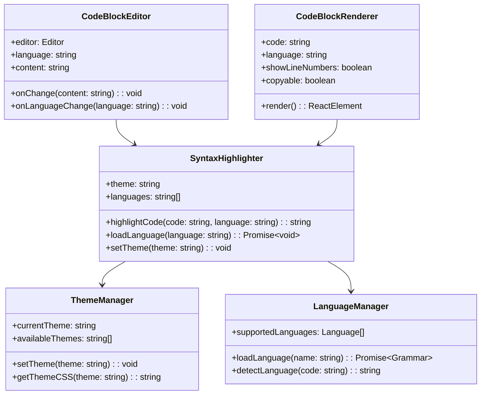

# Code Syntax Highlighter Rebuild Design

## Overview

This document outlines the design for rebuilding the code syntax highlighting functionality in the blog editor to resolve inconsistencies between the editor and preview modes. The current implementation uses two different highlighting libraries (lowlight for editor, react-syntax-highlighter for preview), causing visual and functional discrepancies.

## Current Implementation Analysis

### Editor Implementation (TiptapEditor)

- Uses `@tiptap/extension-code-block-lowlight` with `lowlight` library
- Imports highlight.js languages statically
- Applies GitHub Dark theme via CSS import
- Supports 12+ programming languages
- Language selection through dropdown menu

### Preview Implementation (BlogContent)

- Uses `react-syntax-highlighter` with `vs2015` theme
- Different styling and behavior than editor
- Inconsistent code block rendering
- Copy-to-clipboard functionality

### Issues Identified

1. **Theme Inconsistency**: Editor uses GitHub Dark, preview uses VS2015
2. **Library Mismatch**: Different underlying highlighting engines
3. **Styling Differences**: Inconsistent code block appearance
4. **Language Support**: Potential differences in language detection
5. **Bundle Size**: Static imports increase bundle size

## Technology Stack

### Current Dependencies

- `@tiptap/extension-code-block-lowlight`: ^2.5.5
- `lowlight`: ^3.1.0
- `highlight.js`: ^11.10.0
- `react-syntax-highlighter`: ^15.5.0
- `html-react-parser`: ^5.1.12

### Package Manager

- Using npm instead of pnpm for consistency with user preference

## Architecture

### Unified Highlighting System



### Component Architecture



## Component Specifications

### 1. Unified Syntax Highlighter Service

#### Core Functionality

- Single source of truth for syntax highlighting
- Consistent theme application across editor and preview
- Dynamic language loading to reduce bundle size
- Caching mechanism for loaded languages

#### Implementation Details

```typescript
interface SyntaxHighlighterConfig {
  theme: "github-dark" | "github-light" | "vs2015" | "monokai";
  defaultLanguage: string;
  showLineNumbers: boolean;
  enableCopyButton: boolean;
}

interface Language {
  name: string;
  label: string;
  aliases: string[];
  extensions: string[];
}
```

### 2. Enhanced TiptapEditor CodeBlock Extension

#### Features

- Consistent highlighting with preview
- Language indicator in code blocks
- Syntax validation feedback
- Line number support
- Word wrap toggle

#### Configuration

```typescript
interface CodeBlockConfig {
  languages: Language[];
  defaultLanguage: string;
  showLanguageSelector: boolean;
  showLineNumbers: boolean;
  enableSyntaxValidation: boolean;
}
```

### 3. Unified CodeBlock Renderer

#### Responsibilities

- Render highlighted code for preview
- Maintain visual consistency with editor
- Provide copy-to-clipboard functionality
- Support line highlighting
- Handle overflow and scrolling

### 4. Theme Management System

#### Supported Themes

- GitHub Dark (Primary)
- GitHub Light
- VS Code Dark
- Monokai
- Custom themes support

#### Theme Switching

- Automatic theme detection based on system preference
- Manual theme override capability
- CSS variable-based theme system

## Language Support

### Core Languages (Always Loaded)

1. JavaScript
2. TypeScript
3. HTML
4. CSS
5. JSON

### Extended Languages (Dynamic Loading)

6. Python
7. Java
8. C#
9. C++
10. C
11. PHP
12. Go
13. Rust
14. Bash/Shell
15. SQL
16. XML
17. YAML
18. Markdown

### Language Loading Strategy

- Core languages: Bundled with application
- Extended languages: Loaded on-demand
- Language detection: Automatic based on code content
- Fallback: Plain text with basic formatting

## Implementation Plan

### Phase 1: Core Infrastructure

1. Create unified SyntaxHighlighter service
2. Implement ThemeManager with CSS variables
3. Set up LanguageManager with dynamic loading
4. Configure build system for optimized bundles

### Phase 2: Editor Integration

1. Replace current CodeBlockLowlight extension
2. Implement enhanced CodeBlock extension
3. Update toolbar with new language selector
4. Add syntax validation feedback

### Phase 3: Preview Integration

1. Replace react-syntax-highlighter with unified service
2. Update BlogContent component
3. Ensure consistent rendering with editor
4. Maintain copy-to-clipboard functionality

### Phase 4: Enhancement Features

1. Add line highlighting support
2. Implement code folding capability
3. Add export functionality
4. Include accessibility improvements

## File Structure

### New Components

```
src/
├── components/
│   ├── syntax-highlighter/
│   │   ├── SyntaxHighlighter.tsx
│   │   ├── CodeBlockEditor.tsx
│   │   ├── CodeBlockRenderer.tsx
│   │   ├── LanguageSelector.tsx
│   │   └── ThemeSelector.tsx
│   ├── tiptap-extensions/
│   │   ├── enhanced-code-block.ts
│   │   └── syntax-highlight.ts
├── lib/
│   ├── syntax-highlighter/
│   │   ├── highlighter-service.ts
│   │   ├── theme-manager.ts
│   │   ├── language-manager.ts
│   │   └── utils.ts
│   └── constants/
│       ├── languages.ts
│       └── themes.ts
├── styles/
│   ├── syntax-highlighting/
│   │   ├── themes/
│   │   │   ├── github-dark.css
│   │   │   ├── github-light.css
│   │   │   └── vs-code-dark.css
│   │   └── base.css
```

### Modified Components

```
src/components/
├── tiptap-editor.tsx (Updated)
└── blog-content.tsx (Updated)
```

## Performance Considerations

### Bundle Optimization

- Dynamic language imports reduce initial bundle size
- Code splitting for syntax highlighting features
- Tree-shaking unused language grammars
- Lazy loading of theme CSS files

### Runtime Performance

- Language grammar caching
- Debounced syntax highlighting updates
- Virtual scrolling for large code blocks
- Memory-efficient highlighting for long files

### Loading Strategy

- Progressive enhancement approach
- Graceful fallback to plain text
- Background loading of popular languages
- Prefetch commonly used themes

## Accessibility Features

### Keyboard Navigation

- Tab navigation through code blocks
- Copy shortcut (Ctrl+C) support
- Language selector keyboard access
- Screen reader announcements

### Visual Accessibility

- High contrast theme options
- Adjustable font sizes
- Color blind friendly themes
- Focus indicators for interactive elements

### Screen Reader Support

- Proper ARIA labels
- Code block descriptions
- Language announcements
- Copy action feedback

## Testing Strategy

### Unit Testing

- SyntaxHighlighter service functionality
- Theme switching mechanisms
- Language loading and detection
- Component rendering consistency

### Integration Testing

- Editor-to-preview consistency
- Theme persistence across sessions
- Language detection accuracy
- Copy-to-clipboard functionality

### Visual Regression Testing

- Code block rendering consistency
- Theme application correctness
- Responsive design validation
- Cross-browser compatibility

### Performance Testing

- Bundle size impact measurement
- Language loading time benchmarks
- Memory usage profiling
- Rendering performance metrics

## Configuration

### Default Settings

```typescript
const defaultConfig = {
  theme: "github-dark",
  showLineNumbers: true,
  enableCopyButton: true,
  defaultLanguage: "plaintext",
  autoDetectLanguage: true,
  enableWordWrap: true,
  maxCodeBlockHeight: "500px",
};
```

### User Preferences

- Theme selection persistence
- Language preference memory
- Line number display toggle
- Copy button visibility control

## Migration Strategy

### Backward Compatibility

- Maintain existing API surface
- Support current code block formats
- Preserve existing blog content
- Gradual feature rollout

### Data Migration

- Convert existing code blocks to new format
- Preserve language annotations
- Maintain styling preferences
- Update theme references

### Deployment Plan

- Feature flag controlled rollout
- Performance monitoring
- Rollback capability maintenance

## Success Metrics

### Technical Metrics

- Bundle size reduction: Target 20% decrease
- Rendering performance: Sub-100ms highlighting
- Language loading: Under 200ms dynamic imports
- Memory usage: 15% reduction in code block memory

### User Experience Metrics

- Editor-preview consistency: 100% visual match
- Theme switching: Under 50ms transition
- Copy functionality: 99% success rate
- Accessibility compliance: WCAG 2.1 AA standard

### Quality Metrics

- Test coverage: Minimum 85%
- Cross-browser compatibility: 99% success
- Visual regression: Zero false positives
- Performance budget: No degradation
