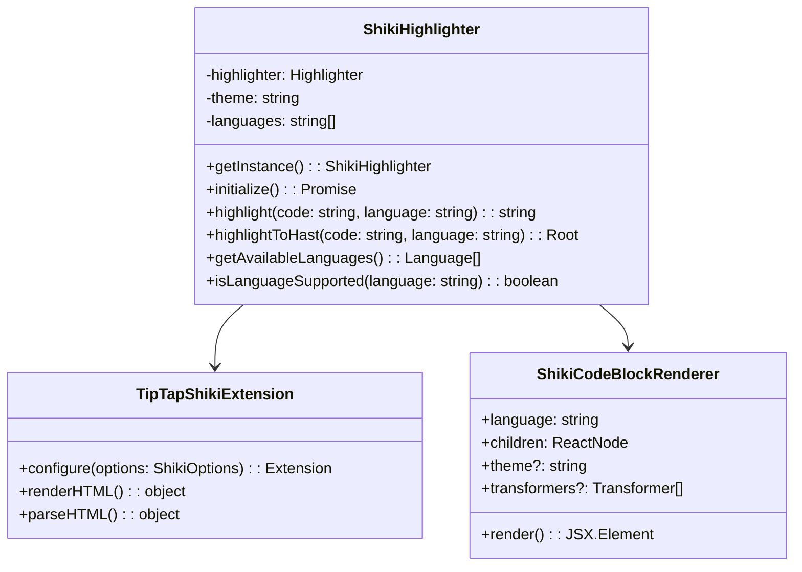
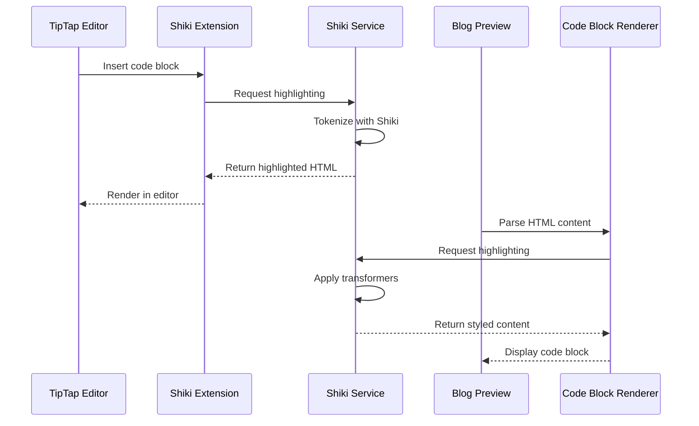
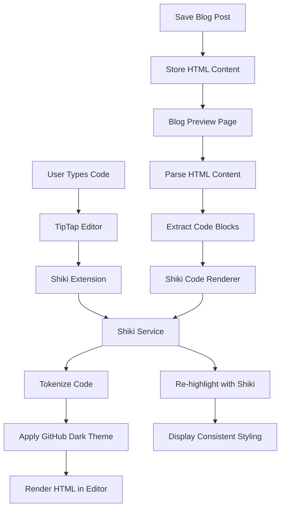
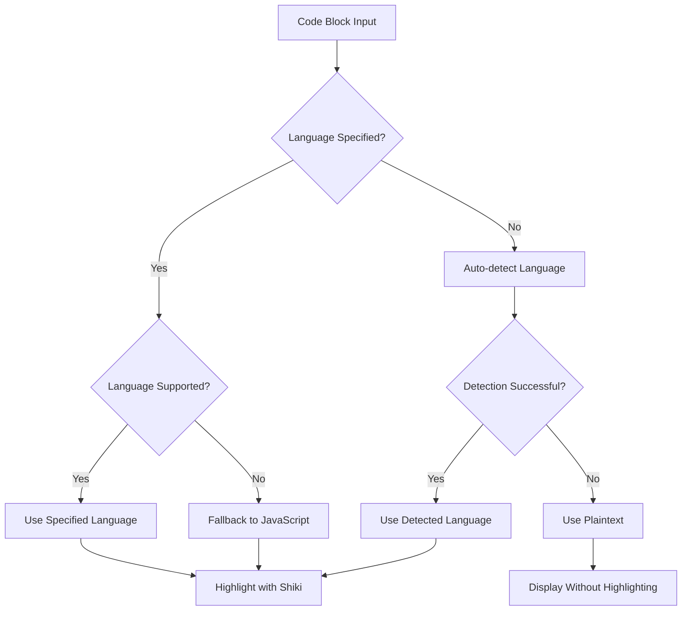

# Syntax Highlighting Migration to Shiki Package

## Overview

This design outlines the comprehensive migration from the current lowlight/highlight.js based syntax highlighting system to Shiki package for enhanced JSX/TSX support and better code rendering. Shiki provides superior syntax highlighting with accurate tokenization, especially for modern JavaScript frameworks and TypeScript.

### Current System Analysis

**Current Implementation:**

- Uses lowlight (highlight.js wrapper) for TipTap editor
- Uses react-syntax-highlighter for blog preview
- Custom SyntaxHighlighterService with JSX/TSX enhancement
- GitHub Dark theme with custom CSS styling
- Supports 15 languages including basic JSX/TSX

**Limitations:**

- Inconsistent JSX/TSX highlighting quality
- Manual JSX enhancement patterns
- Dual dependency system (lowlight + react-syntax-highlighter)
- Limited theme options
- Performance overhead with large code blocks

## Technology Stack

### New Dependencies

- **shiki**: Modern syntax highlighter with VS Code tokenization
- **@shikijs/transformers**: Additional transformers for enhanced features
- **hast-util-to-html**: Convert AST to HTML string

### Removal

- **lowlight**: Replace with Shiki
- **highlight.js**: No longer needed
- **react-syntax-highlighter**: Replace with Shiki
- **@tiptap/extension-code-block-lowlight**: Replace with custom implementation

## Architecture

### Shiki Service Layer



### Component Integration Flow



## Implementation Strategy

### Phase 1: Shiki Service Implementation

**File: `src/lib/shiki-highlighter.ts`**

```typescript
interface ShikiConfig {
  themes: string[];
  languages: string[];
  defaultTheme: string;
}

interface Language {
  value: string;
  label: string;
  aliases?: string[];
}

class ShikiHighlighterService {
  private static instance: ShikiHighlighterService;
  private highlighter: Highlighter | null = null;
  private isInitialized = false;

  // Language support with JSX/TSX
  private supportedLanguages: Language[] = [
    { value: "javascript", label: "JavaScript", aliases: ["js"] },
    { value: "typescript", label: "TypeScript", aliases: ["ts"] },
    { value: "jsx", label: "JSX" },
    { value: "tsx", label: "TSX" },
    { value: "python", label: "Python", aliases: ["py"] },
    { value: "html", label: "HTML" },
    { value: "css", label: "CSS" },
    { value: "json", label: "JSON" },
    { value: "bash", label: "Bash", aliases: ["sh", "shell"] },
    { value: "sql", label: "SQL" },
    { value: "java", label: "Java" },
    { value: "csharp", label: "C#", aliases: ["cs"] },
    { value: "cpp", label: "C++" },
    { value: "c", label: "C" },
    { value: "xml", label: "XML" },
  ];

  async initialize(): Promise<void>;
  highlight(code: string, language: string): string;
  highlightToHast(code: string, language: string): Root;
  getAvailableLanguages(): Language[];
  isLanguageSupported(language: string): boolean;
  getLanguageLabel(language: string): string;
}
```

### Phase 2: TipTap Extension Replacement

**File: `src/extensions/tiptap-shiki-extension.ts`**

Custom TipTap extension to replace CodeBlockLowlight:

```typescript
interface ShikiExtensionOptions {
  highlighter: ShikiHighlighterService;
  defaultLanguage: string;
  HTMLAttributes: Record<string, any>;
}

const TipTapShikiExtension = Node.create<ShikiExtensionOptions>({
  name: "shikiCodeBlock",
  group: "block",
  content: "text*",
  marks: "",
  code: true,
  defining: true,

  addAttributes() {
    return {
      language: {
        default: this.options.defaultLanguage,
        parseHTML: (element) => element.getAttribute("data-language"),
        renderHTML: (attributes) => ({
          "data-language": attributes.language,
        }),
      },
    };
  },

  parseHTML() {
    return [{ tag: "pre[data-language]" }];
  },

  renderHTML({ node, HTMLAttributes }) {
    const language = node.attrs.language || this.options.defaultLanguage;
    const code = node.textContent;

    const highlightedCode = this.options.highlighter.highlight(code, language);

    return [
      "pre",
      mergeAttributes(this.options.HTMLAttributes, HTMLAttributes, {
        "data-language": language,
      }),
      ["code", { innerHTML: highlightedCode }],
    ];
  },
});
```

### Phase 3: Blog Preview Component Update

**File: `src/components/shiki-code-block-renderer.tsx`**

Replace CodeBlockRenderer with Shiki-powered component:

```typescript
interface ShikiCodeBlockRendererProps {
  children: string;
  language: string;
  theme?: string;
  showLineNumbers?: boolean;
  transformers?: BundledTransformer[];
  className?: string;
}

const ShikiCodeBlockRenderer: React.FC<ShikiCodeBlockRendererProps> = ({
  children,
  language,
  theme = "github-dark",
  showLineNumbers = false,
  transformers = [],
  className = "",
}) => {
  const [copied, setCopied] = useState(false);
  const [highlightedCode, setHighlightedCode] = useState<string>("");

  useEffect(() => {
    const highlightCode = async () => {
      const shiki = ShikiHighlighterService.getInstance();
      await shiki.initialize();

      const html = shiki.highlight(children, language);
      setHighlightedCode(html);
    };

    highlightCode();
  }, [children, language]);

  const handleCopy = async () => {
    await navigator.clipboard.writeText(children);
    setCopied(true);
    setTimeout(() => setCopied(false), 2000);
  };

  return (
    <div className={`relative group shiki-container ${className}`}>
      <div className="relative bg-[#0d1117] rounded-lg border border-gray-800 overflow-hidden">
        {language && language !== "plaintext" && (
          <div className="flex items-center justify-between px-4 py-2 bg-[#161b22] border-b border-gray-800">
            <span className="text-xs text-gray-300 font-mono">
              {shiki.getLanguageLabel(language)}
            </span>
            <Button
              variant="ghost"
              size="icon"
              className="h-6 w-6 opacity-70 hover:opacity-100"
              onClick={handleCopy}
            >
              {copied ? (
                <Check className="h-3 w-3 text-green-400" />
              ) : (
                <Copy className="h-3 w-3" />
              )}
            </Button>
          </div>
        )}

        <div className="relative">
          <pre className="p-4 overflow-x-auto text-sm leading-relaxed">
            <code
              className="shiki-code"
              dangerouslySetInnerHTML={{ __html: highlightedCode }}
            />
          </pre>
        </div>
      </div>
    </div>
  );
};
```

### Phase 4: Styling System Update

**File: `src/styles/shiki-highlighting.css`**

Replace syntax-highlighting.css with Shiki-optimized styles:

```css
/* Shiki GitHub Dark Theme Integration */
.shiki-container {
  font-family: "SF Mono", Monaco, "Roboto Mono", Menlo, Consolas, "Ubuntu Mono",
    monospace;
}

.shiki-code {
  display: block;
  overflow-x: auto;
  padding: 0;
  margin: 0;
  background: transparent;
  color: inherit;
}

/* TipTap Editor Shiki Integration */
.ProseMirror pre[data-language] {
  background: #0d1117;
  border: 1px solid #30363d;
  border-radius: 6px;
  padding: 0.75rem 1rem;
  font-family: "SF Mono", Monaco, "Roboto Mono", Menlo, Consolas, "Ubuntu Mono",
    monospace;
  font-size: 0.875rem;
  line-height: 1.5;
  overflow-x: auto;
  position: relative;
}

.ProseMirror pre code {
  color: inherit;
  padding: 0;
  background: none;
  font-size: inherit;
  border-radius: 0;
  white-space: pre;
}

/* Language indicator */
.ProseMirror pre[data-language]:before {
  content: attr(data-language);
  position: absolute;
  top: 0.5rem;
  right: 0.5rem;
  font-size: 0.75rem;
  color: #8b949e;
  text-transform: uppercase;
  letter-spacing: 0.05em;
  z-index: 1;
}

/* Responsive design */
@media (max-width: 768px) {
  .ProseMirror pre[data-language] {
    font-size: 0.8rem;
    padding: 0.5rem;
  }

  .shiki-container pre {
    font-size: 0.8rem;
    padding: 0.5rem;
  }
}

/* Focus states for accessibility */
.shiki-container:focus-within {
  outline: 2px solid #0969da;
  outline-offset: 2px;
}

/* Copy button hover states */
.shiki-container .copy-button {
  transition: all 0.2s ease;
}

.shiki-container:hover .copy-button {
  opacity: 1;
}
```

## Data Flow Architecture

### Editor to Preview Consistency



### Language Detection and Fallback



## Migration Steps

### Step 1: Package Management

```bash
# Remove old dependencies
npm uninstall lowlight highlight.js react-syntax-highlighter @tiptap/extension-code-block-lowlight

# Install Shiki
npm install shiki @shikijs/transformers hast-util-to-html
```

### Step 2: Service Implementation

1. Create `src/lib/shiki-highlighter.ts`
2. Implement ShikiHighlighterService class
3. Configure language support and themes
4. Add initialization and caching logic

### Step 3: Extension Development

1. Create `src/extensions/tiptap-shiki-extension.ts`
2. Implement custom TipTap extension
3. Replace CodeBlockLowlight usage
4. Update toolbar language selection

### Step 4: Component Updates

1. Create `src/components/shiki-code-block-renderer.tsx`
2. Update `src/components/tiptap-editor.tsx`
3. Update blog content parser in `src/app/(web)/blogs/[slug]/components/blog-content.tsx`
4. Remove old CodeBlockRenderer component

### Step 5: Styling Migration

1. Create `src/styles/shiki-highlighting.css`
2. Remove `src/styles/syntax-highlighting.css`
3. Update global CSS imports
4. Test theme consistency

### Step 6: Configuration Updates

1. Update `next.config.ts` if needed for Shiki
2. Update `package.json` scripts
3. Update TypeScript types
4. Test build process

## File Modifications Required

### New Files

- `src/lib/shiki-highlighter.ts` - Core Shiki service
- `src/extensions/tiptap-shiki-extension.ts` - TipTap extension
- `src/components/shiki-code-block-renderer.tsx` - Preview component
- `src/styles/shiki-highlighting.css` - Shiki-specific styles

### Modified Files

- `src/components/tiptap-editor.tsx` - Replace lowlight extension
- `src/app/(web)/blogs/[slug]/components/blog-content.tsx` - Update parser
- `src/app/globals.css` - Update CSS imports
- `package.json` - Update dependencies

### Removed Files

- `src/lib/syntax-highlighter.ts` - Replace with Shiki service
- `src/components/code-block-renderer.tsx` - Replace with Shiki version
- `src/styles/syntax-highlighting.css` - Replace with Shiki styles

## Performance Considerations

### Bundle Size Optimization

- Use dynamic imports for Shiki languages
- Implement code splitting for editor components
- Cache highlighter instance globally
- Lazy load language grammars

### Runtime Performance

- Initialize Shiki once on app start
- Cache highlighted code blocks
- Use Web Workers for large code highlighting
- Implement debounced highlighting in editor

### Memory Management

- Dispose unused language grammars
- Implement cleanup for cached results
- Monitor memory usage with large documents
- Use weak references where appropriate

## Testing Strategy

### Unit Testing

- Shiki service initialization
- Language detection and fallback
- HTML output validation
- Error handling scenarios

### Integration Testing

- Editor and preview consistency
- Theme application
- Copy functionality
- Language switching

### Visual Testing

- Code block rendering accuracy
- Theme consistency across components
- Responsive design validation
- Accessibility compliance

## Security Considerations

### XSS Prevention

- Sanitize code input before highlighting
- Validate language parameters
- Escape HTML in error scenarios
- Use safe HTML rendering methods

### Content Security Policy

- Allow inline styles for Shiki themes
- Restrict script execution in code blocks
- Validate theme configuration
- Implement input validation

## Error Handling

### Graceful Degradation

- Fallback to plaintext on highlighting errors
- Display user-friendly error messages
- Log errors for debugging
- Maintain editor functionality

### Recovery Strategies

- Retry highlighting with different language
- Cache error states to prevent repeated failures
- Provide manual language override
- Implement service health checks

## Accessibility Features

### Keyboard Navigation

- Focus management in code blocks
- Tab navigation for copy buttons
- Screen reader support
- High contrast theme support

### ARIA Labels

- Language announcements
- Copy button descriptions
- Code block boundaries
- Error state communication

## Browser Compatibility

### Modern Browser Support

- ES2020+ features for Shiki
- CSS custom properties for theming
- ResizeObserver for responsive code blocks
- Clipboard API for copy functionality

### Fallback Support

- Graceful degradation for older browsers
- Polyfills for missing APIs
- Progressive enhancement approach
- Alternative copy mechanisms
